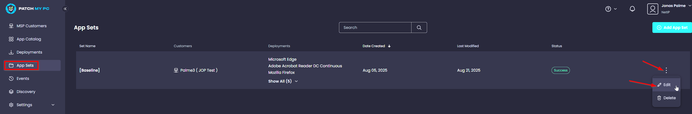
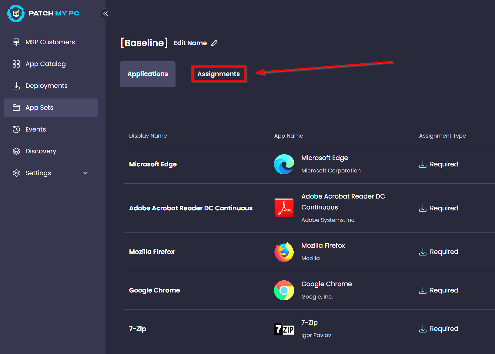
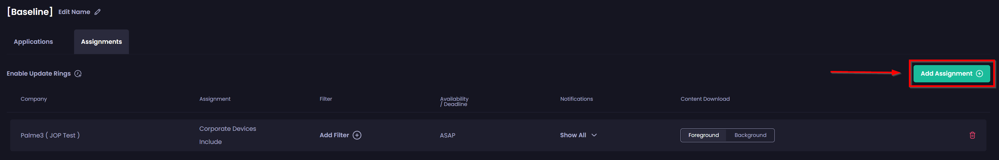
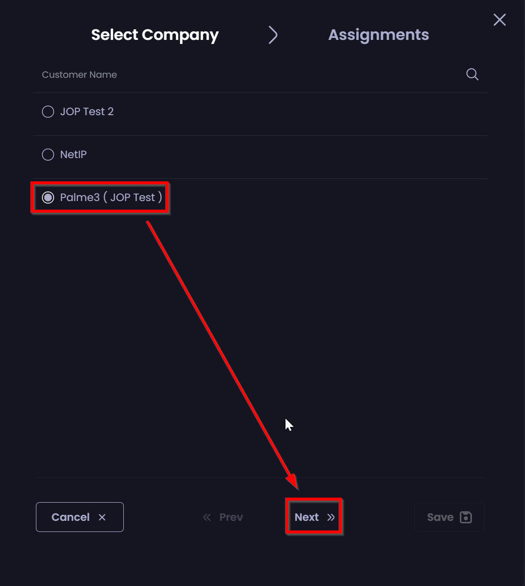
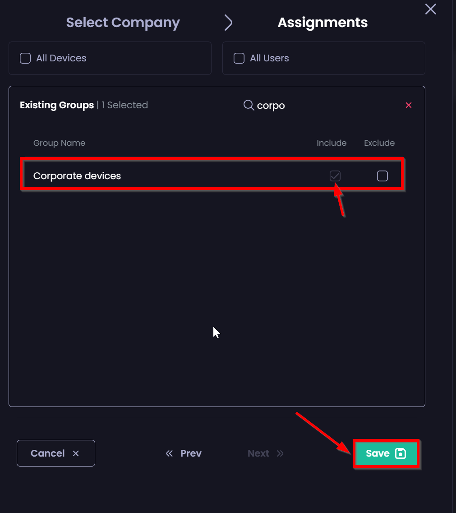

# Assigning a customer to our Baseline Application set
---
1. Go to **App sets**
    - Click on the three dots -> **Edit**

2. Click **Assignments**

3. Click **Add Assignment**

4. Choose your customer and clikc **Next**

5. Choose which group you want to deploy Baseline Applications to:
    - In this example we've used a dynamic security group called _**Corporate Devices**_
    