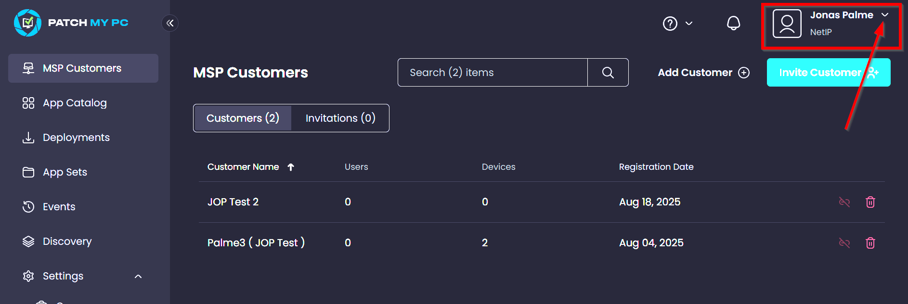
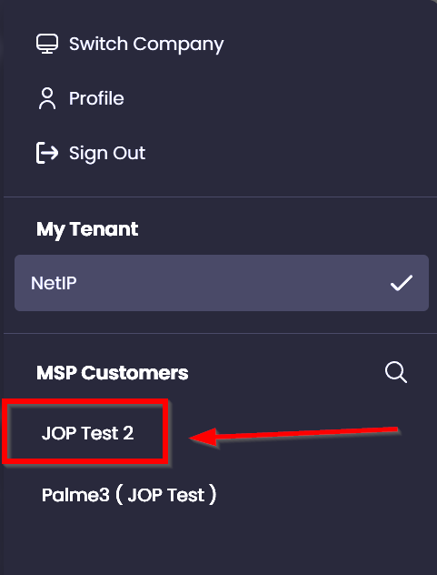
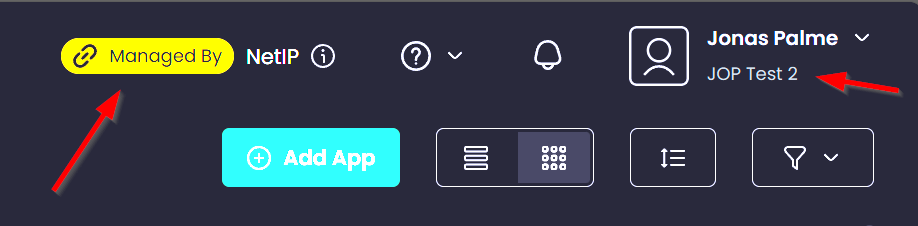
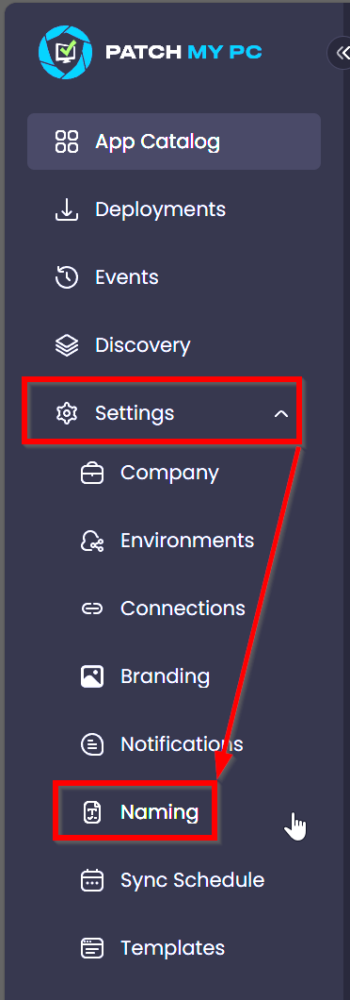
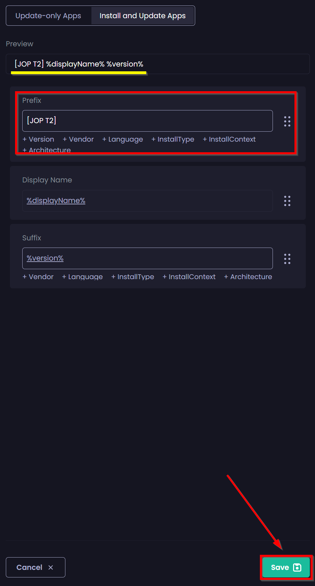
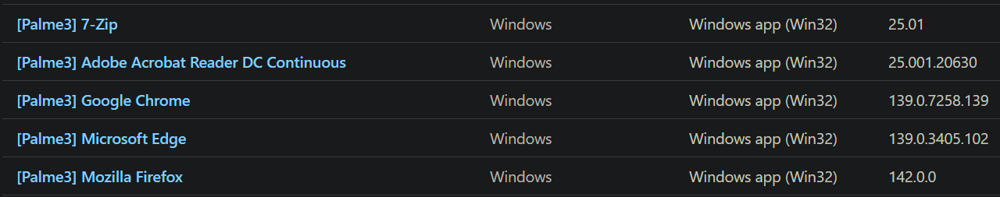

## Creating specific customer prefix

>[!Important]
>**After onboarding a customer to the MSP portal, ensure that a customer-specific naming convention prefix is added by following this guide**

### 1 Accessing customer tenant 
1. Sign in to the [Patch My PC Cloud Admin Portal](https://portal.patchmypc.com).
2. Next, hit the small downward facing icon

3. Choose your customers tenant

4. You can always check if you are working on a customer tenant by looking at these to places:

---
### 2 Configure naming prefix

1. Once connected to your customer, go to **Settings** -> **Naming**

2. Now enter your desired prefix for your customer and hit **save**
>[!Tip] _You can utilize the **preview** feature to see the prefix_
   -  

3. End results with naming prefix added ([Palme3] was added as a prefix in the image below)
   